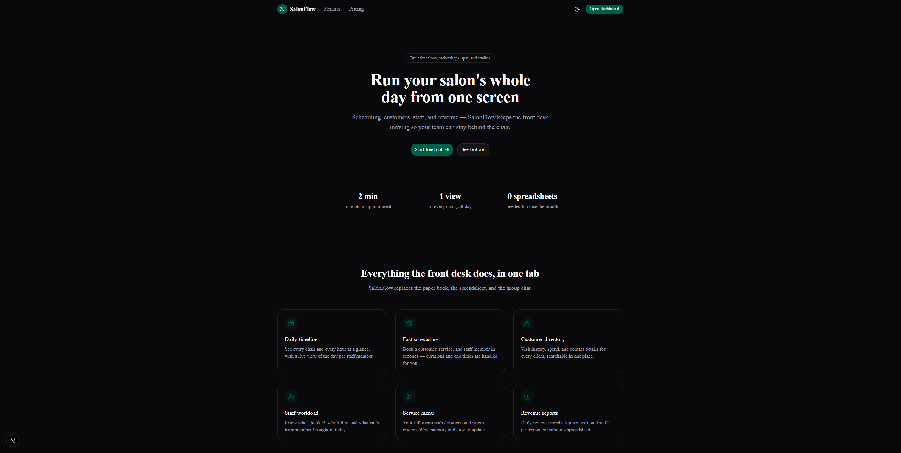
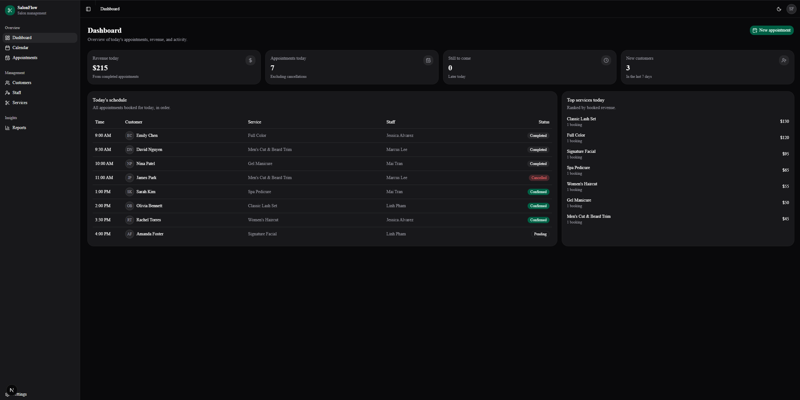
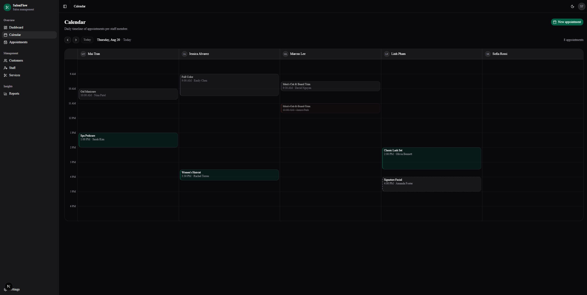
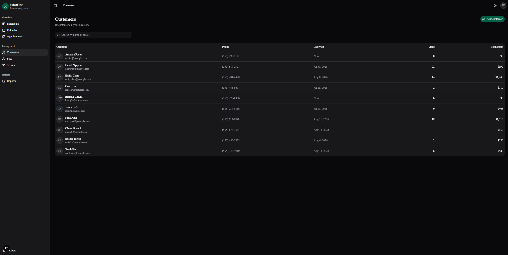
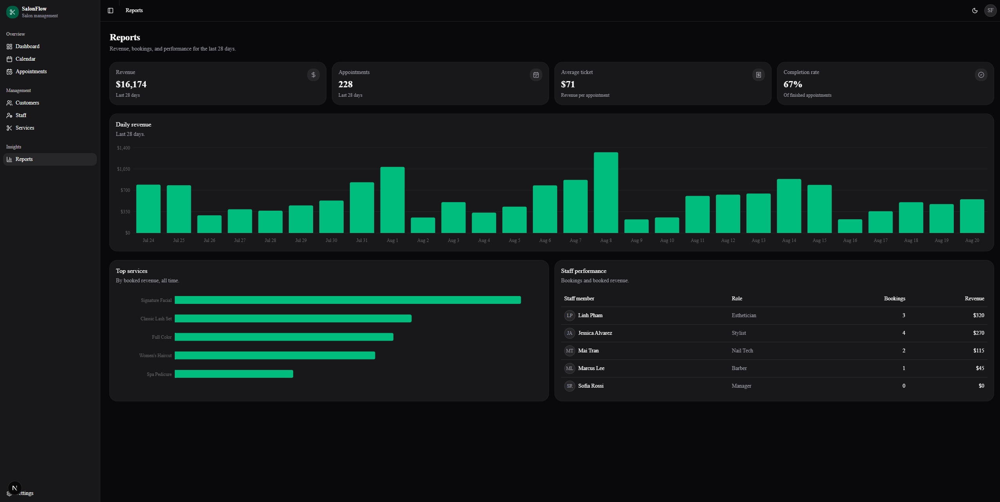

# SalonFlow

A salon management platform for hair salons, barbershops, nail salons,
spas, and beauty studios. There's scheduling, customers, staff, services, and
revenue reporting in one dashboard.

**Status:** UI-complete on mock data. Supabase persistence is next
(see [docs/supabase-setup.md](docs/supabase-setup.md)).

## Stack

- [Next.js 16](https://nextjs.org) (App Router, Turbopack)
- TypeScript, Tailwind CSS 4
- [shadcn/ui](https://ui.shadcn.com) (Nova style, built on Base UI)
- React Hook Form + Zod
- Recharts
- Supabase (PostgreSQL + auth) — groundwork in place

## Getting started

```sh
npm install
npm run dev
```

Open [http://localhost:3000](http://localhost:3000) for the marketing
site, or [http://localhost:3000/dashboard](http://localhost:3000/dashboard)
for the app. Everything runs on mock data — no environment setup needed.

To demo the app while keeping Supabase configured, add this to `.env.local`:

```env
NEXT_PUBLIC_DEMO_MODE=true
```

This forces the dashboard and its related pages to use the built-in mock data
and skips Supabase authentication. Remove the setting or change it to `false`
to use the connected Supabase project again. Mock dates are generated relative
to the current day, so screenshots continue to show a realistic schedule.

## Screenshots

These screenshots show the main workflow and product surface.

<p align="center">
  
</p>
<p align="center"><em>Marketing homepage</em></p>

<p align="center">
  
</p>
<p align="center"><em>Dashboard overview</em></p>

<p align="center">
  
</p>
<p align="center"><em>Calendar and appointment planning</em></p>

<p align="center">
  
</p>
<p align="center"><em>Customer management</em></p>

<p align="center">
  
</p>
<p align="center"><em>Reports and business insights</em></p>

## Scripts

| Command | What it does |
| --- | --- |
| `npm run dev` | Dev server with hot reload |
| `npm run build` | Production build + type check |
| `npm run lint` | ESLint |

## Project structure

```
src/
  app/
    (marketing)/   Landing page — public site
    (dashboard)/   The app: dashboard, calendar, appointments,
                   customers, staff, services, reports, settings
  components/      UI by domain (ui/ is shadcn-generated)
  features/        Business logic: queries, constants, builders
  lib/             Clients, validations, mock data, utils
  types/           Domain types
supabase/
  migrations/      SQL schema (multi-tenant + RLS)
```

Pages fetch data via `features/*/queries.ts` and assemble components - business
logic never lives in page files.

## Git workflow

`main` ← `dev` ← `feature/*` branches, PRs into `dev`.
