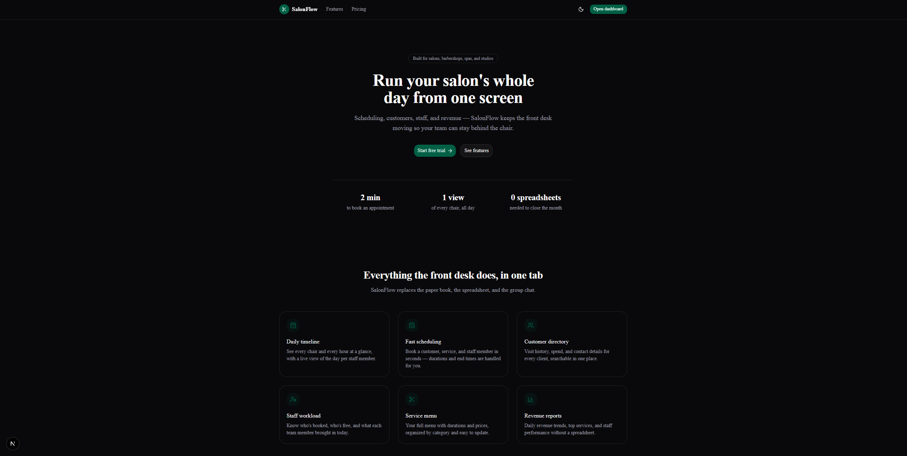
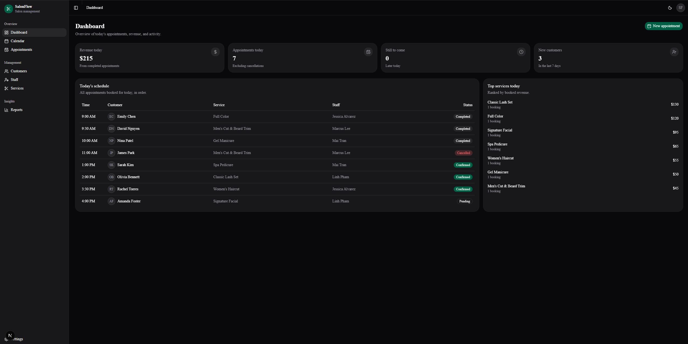
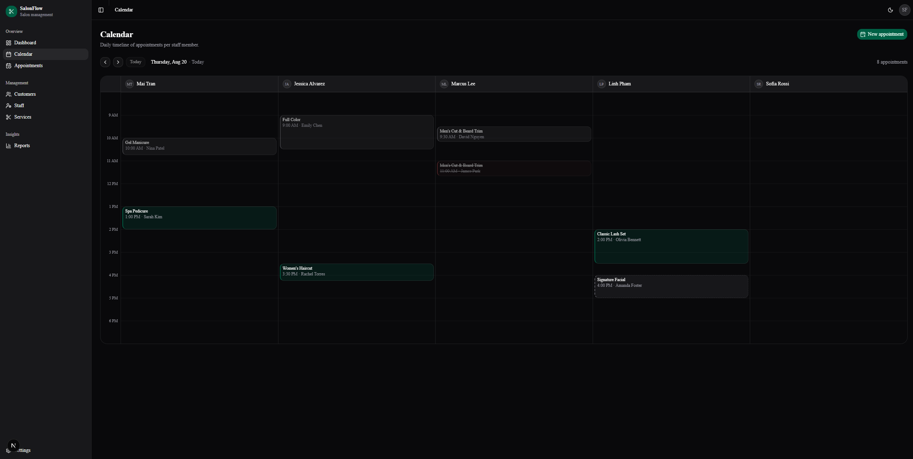
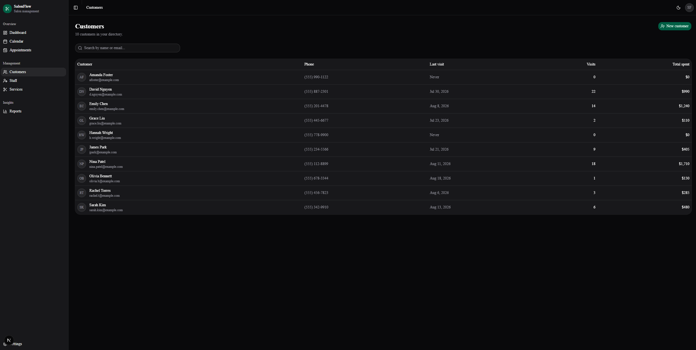
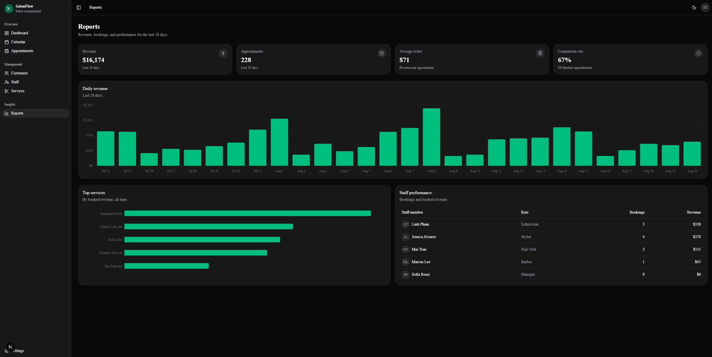

<p align="center">
  
</p>

# SalonFlow

<p align="center">
  <a href="https://github.com/quangshuynh/salonflow/actions/workflows/ci.yml">
    
  </a>
  
</p>

SalonFlow is a salon-management SaaS application for scheduling appointments,
managing customers, staff, and services, and tracking business performance from
one dashboard.

**Status:** The full product UI and workflows are implemented with realistic
demo data. Supabase-backed persistence and authentication are the next major
milestone. See [docs/supabase-setup.md](docs/supabase-setup.md).

## Features

- Dashboard with daily scheduling and business metrics
- Calendar and appointment management
- Customer profiles and visit history
- Staff and service management
- Revenue and service-performance reporting
- Responsive marketing and application interfaces
- Built-in demo mode with realistic, date-aware mock data
- Supabase schema groundwork for multi-tenant persistence and row-level security

## Stack

- [Next.js 16](https://nextjs.org) — App Router and Turbopack
- TypeScript
- Tailwind CSS 4
- [shadcn/ui](https://ui.shadcn.com) — Nova style, built on Base UI
- React Hook Form + Zod
- Recharts
- Supabase — PostgreSQL and authentication
- Vitest

## Getting started

Install dependencies and start the development server:

```sh
npm install
npm run dev
```

Open `http://localhost:3000` for the marketing site or
`http://localhost:3000/dashboard` for the application.

The application runs on built-in mock data by default, so no external
services or environment configuration are required to explore the
current product.

### Demo mode

To explicitly use the demo experience while keeping Supabase configured,
add the following to `.env.local`:

``` env
NEXT_PUBLIC_DEMO_MODE=true
```

Demo mode uses the built-in mock data and skips Supabase authentication.
The dashboard header shows a "Demo data" badge while it is active, so the
interface makes clear up front that changes are not persisted.

Remove the setting or change it to `false` to use the configured
Supabase integration.

Mock dates are generated relative to the current day so the dashboard
and screenshots continue to show a realistic schedule.

## Screenshots

### Marketing site

<p align="center">  </p> <p align="center"> <em>Public marketing homepage</em> </p>

### Dashboard

<p align="center">  </p> <p align="center"> <em>Dashboard with today's schedule and business overview</em> </p>

### Calendar

<p align="center">  </p> <p align="center"> <em>Weekly calendar and appointment planning</em> </p>

### Customers

<p align="center">  </p> <p align="center"> <em>Customer management</em> </p>

### Reports

<p align="center">  </p> <p align="center"> <em>Revenue and service-performance reporting</em> </p>

## Architecture

SalonFlow separates page composition, reusable UI, domain logic,
validation, and data access so the application can move from demo data
to persistent storage without coupling business logic directly to page
components.

``` text
src/
  app/
    (marketing)/    Public marketing site
    (dashboard)/    Dashboard, calendar, appointments,
                    customers, staff, services, reports, settings

  components/       UI organized by domain
    ui/             Generated shadcn/ui components

  features/         Domain queries, constants, and builders
  lib/              Clients, validation, mock data, and utilities
  types/            Shared domain types

supabase/
  migrations/       PostgreSQL schema, multi-tenancy, and RLS
```

Pages compose the application using domain components and
`features/*/queries.ts`; data-access and business logic stay outside
page components.

### Data layer

The current product experience is backed by deterministic mock data.

The repository also contains Supabase migrations defining the groundwork
for the persistent data model, including multi-tenant data isolation and
row-level-security policies.

The next major engineering milestone is completing the production path:

``` text
authenticate
    ↓
load tenant
    ↓
read / mutate domain data
    ↓
persist to PostgreSQL
    ↓
enforce tenant boundaries with RLS
    ↓
reload with the same correct state
```

Until that path is complete, the demo experience remains the primary
supported way to explore SalonFlow.

## Validation

Forms use React Hook Form and Zod for structured input handling and
validation.

Keeping validation separate from page components makes domain rules
easier to reuse as the persistent Supabase data path is completed.

## Testing and CI

The project uses Vitest for automated testing.

CI checks the application before changes are merged, including linting,
automated tests, and the production build.

Run the checks locally with:

``` sh
npm run lint
npm test
npm run build
```

## Scripts

  Command                What it does
  ---------------------- ----------------------------------------------
  `npm run dev`          Start the development server with hot reload
  `npm run build`        Create the production build
  `npm run lint`         Run ESLint
  `npm test`             Run automated tests
  `npm run test:watch`   Run tests in watch mode

## Current limitations

SalonFlow is not presented as a production-ready SaaS product yet.

The main current limitation is that the complete dashboard experience
still uses mock data. Supabase schema and integration groundwork exist,
but persistent CRUD, authentication, and end-to-end tenant isolation
still need to be completed and verified.

This is intentionally the next development milestone rather than
expanding the product with additional surface-area features.

## Development workflow

Development follows:

``` text
main ← dev ← feature/*
```

Feature work is developed on focused branches and merged through pull
requests into `dev` before reaching `main`.
